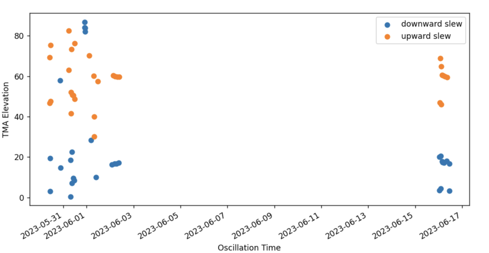

# Oscillations in the hardpoint forces of M1M3

## Abstract

This technote contains describes oscillations seen in the M1M3 cell hardpoint
forces, these events are particularly important to understand in order to verify that it is safe to put glass on the M1M3 mirror cell.
In this technote we discuss a few types of oscillations:
1. Oscillations During Slews
    - identification of events: [SITCOMTN_81_identify_oscillations_during_slew](https://github.com/lsst-sitcom/notebooks_vandv/blob/6309fee1fd026f1dbbafd5f64ffa503aa45560e4/notebooks/tel_and_site/subsys_req_ver/m1m3/SITCOMTN_81_identify_oscillations_during_slew.ipynb)
    - events caused by azimuth topple blocks: [SITCOM-1390_topple_block_vibration](https://github.com/lsst-sitcom/notebooks_vandv/blob/tickets/SITCOM-1390/notebooks/tel_and_site/subsys_req_ver/m1m3/SITCOM-1390_topple_block_vibration.ipynb)
    - events with unknown cause: [SITCOMTN_81_characterize_oscillations_during_slew](https://github.com/lsst-sitcom/notebooks_vandv/blob/6309fee1fd026f1dbbafd5f64ffa503aa45560e4/notebooks/tel_and_site/subsys_req_ver/m1m3/SITCOMTN_81_characterize_oscillations_during_slew.ipynb)
2. Strong Continuous oscillations: [SITCOMTN-081_strong_vibration_analysis](https://github.com/lsst-sitcom/notebooks_vandv/blob/develop/notebooks/tel_and_site/subsys_req_ver/m1m3/SITCOMTN-081_strong_vibration_analysis.ipynb)
3. Oscillations due to an earthquake (link to notebook, no m1m3 data)

The data analyzed in this technote is mainly made up of events during the dynamic testing of M1M3 in the second half of 2023. 
The relevant requriements are
- [LVV-11306](https://jira.lsstcorp.org/browse/LVV-11306): All vibration sources from the mirror support system combined SHALL not produce more than +/- 0.38 micron of mirror piston motion, +/0.23 micron of mirror decenter and +/ 1 e-6 degree of mirror tilt (RMS values) (see document-7271).
- For repeating oscillations we want the amplitude of oscillations be *1/10?* of breakaway force (3000N), or less than 300N (where is requirement for this). See disscussion under GSCN4 in [this confluence page](https://confluence.lsstcorp.org/pages/viewpage.action?pageId=222730451#SystemIntegrationTesting/VerificationBeforeGlassinstallation-RequirementsandCriteriaforM1M3GlassSafety).

A summary of the analysis in this technote can be found in the below table. 

| Type of Hardpoint Oscillation | Amplitude [N] | Repeating | Cause         | Requirements  [N]   |
|-------------------------------|---------------|-----------|---------------|------------------|
| Azimuth Slews                     | ###           | Yes       | topple blocks         | < 300    |
| Elevation Slews                   | ###           | Yes       | Unkown                | < 300    |
| Strong continuous oscillation     | ###           | No        | control software      | < 3000    |
| Earthquake                        | No M1M3 Data  | Yes       | Mag ~6 earthquake    |  < 3000   |

<!-- the identification and characterization of these oscillations.
All of these oscillations were originally identified in the hard point measuredForces, but are seen throughout the M1M3 (and TMA) monitoring systems.
These oscillations can be broadly broken into two categories based on whether they occur during a slew.
Additionally, we mention the low amplitude continuous oscillations that occur at low elevation.
This is linked to SITCOM-918 -->

## Introduction

The structure of this technote is as follows, first we discuss oscillation events during a slew. This includes the identification and characterization of these events as well as possible causes. Then, we present a select set of other oscillations that occured outside of slewing conditions.

- Identification of slew events
- characterization of oscillation events

> - hardpoints
> - IMS
> - force actuators
> - TMA

- Fourier transform of everything
- continuous oscillations at low elevation

For the M1M3 oscillations during a slew w

## Oscillations During Slews

### Identification of events

These oscillation events were originally discovered by visual inspection of the
measured forces on the hardpoint actuators during a slew. This data can be accessed in the EFD under the table `lsst.sal.MTM1M3.hardpointActuatorData` with the columns starting with `measuredForce`.
To identify the oscillation events during a slew we used a rolling standard deviation of the measured force on each of the six hardpoints.
A 2 second window was used for the rolling and all peaks with a standard deviation above 100 N were flagged.
Next, for each hardpoint individually peaks within 2 seconds were combined in order to only flag once on each potential oscillation event.
Then, we used a 4-second window to combine peaks across hardpoints only keeping events that are detected in more than 4 of the hardpoints.

An example of how oscillation events are identified is shown in figure 1.

:::{figure} ./_static/20230627_mtmount.elevation.actualTorque.png
:name: fig-oscillation-062-torque
:target: ../_images/20230627_mtmount.elevation.actualTorque.png

Chronograf screenshot of elevation torque during oscillation event.
:::

:::{figure} ./_static/Identify_events.png
:name: fig-identify-events
:target: ../_images/Identify_events.png

This figure shows the elevation of the TMA (Telescope Mount Assembly) as an orange line, the colored points show a rolling standard deviation of the hardpoint measured forces (0-5).
Oscillations are initially flagged as times during a slew with large peaks in the rolling standard deviation of at least 4 of the hardpoint forces. 
The red diamonds in this plot note two of these flagged events. 
:::

### Oscillations during azimuth slews

Figure blah show

*Caption for the image.*

### Oscillations during elevation slews 

- types of these events we see (upward and downward shift)
- we see in the ims data as well 
- amplitude of these slews are small 
- still do not know the cause of these events 

## Strong continuous oscillation

### Summary of event 

On June 27th, during M1M3+TMA integration tests, observers noticed a powerful vibration on the TMA and M1M3.
The observers described noises similar to hammers hitting metal plates.
This was the only time such an event happened.
A summary of the event is as follows: 
1. the gateway tests were completed at 5% speed (Block 34).
2. during a slew the strong vibrations started at 2023-06-28 01:08 UTC and lasted 12 minutes until 01:20 UTC.
These vibrations were driven by the TMA elevation drives, not another subsytem.
3. In response, the force balance system was disabled and the mirror was lowered.

More details can be found in the test log ([2023, 06, 27 - M1M3 Test Log]), and jira ticket [SITCOM-1089].
It is thought that this event occurred because the TMA was slewed/homed with the force balance system on, subsequently the control software was changed to not allow this state in the future.
But, this event gives us the opportunity to understand how large vibrations will affect the M1M3 cell.
**In particular, we wanted to understand if the TMA driven oscillations resonated with the M1M3 force balance system causing a positive feedback loop in the force on the mirror.**

:::{figure} ./_static/20230627_mtmount.elevation.actualTorque.png
:name: fig-oscillation-0627-torque
:target: ../_images/20230627_mtmount.elevation.actualTorque.png

Chronograf screenshot of elevation torque during oscillation event.
:::

:::{figure} ./_static/20230627_mtmount.elevation.actualTorqueZoom.png
:name: fig-oscillation-0627-torque-zoom
:target: ../_images/20230627_mtmount.elevation.actualTorqueZoom.png

Zoom in of oscillations showing periodic behavior.
:::

The above images show the TMA torque behavior during this event.
The 12-minute duration can be seen with a peak to peak amplitude of ~500k Nm (+/- 250k).

:::{figure} ./_static/20230627_MTM1M3.hardpointActuatorData.measuredForceN.png
:name: fig-oscillation-0627-hardpoint-force
:target: ../_images/20230627_MTM1M3.hardpointActuatorData.measuredForceN.png

Chronograf screenshot of hardpoint forces during event.
:::

The above image shows the hardpoint forces, it can be noted that the event starts at 01:08.
To begin with the mirror was raised with the force balance system was active, then at 01:11:15 the force balance system was deactivated, starting at 01:11:45 the mirror was lowered and it reached the static supports at ~01:15:15.
If the M1M3 cell had any positive feedback during the event, we would expect the amplitude of the hardpoint measured forces to change with time. Or we would expect the observed frequencies of the oscillation to change with the state of the M1M3.
Based on the measured force image above the amplitude is roughly constant for each state of the mirror, and the Mirror did not break away.
*what is requirement for continuous oscillation: LTS-88-REQ-0065 All vibration sources from the mirror support system combined SHALL not produce more than +/- 0.38 micron of mirror piston motion, +/0.23 micron of mirror decenter and +/ 1 e-6 degree of mirror tilt (RMS values)*
[LVV-11306]
Below we show a PSD of the event computing it for the total event, and each of the different states of the M1M3 during the event.
We see no evolution of the vibrations during the state changes of the M1M3 cell.
**From this we conclude the cell was driven by the TMA but did not contain any positive feedback or coupling with the TMA, for this event**.

:::{figure} ./_static/20230627_hardpoints_psd.png
:name: fig-oscillation-0627-hardpoint-psd
:target: ../_images/20230627_hardpoints_psd.png

PSD of hardpoint forces for 3 of the hardpoints showing no evolution with M1M3 state (different colored lines). The black vertical lines show the vibration peaks identified in the TMA torque. It can be seen that there are a few vibration peaks in the hardpoints not seen in the TMA torque.
:::

## Vibration due to the topple block

There are two topple blocks at az~-75 and az~-53 to detect the direction of the rotation in azimuth and to prevent TMA from slewing in one direction over the maximum angle of its rotation. While hitting the topple block and flipping it, it generates vibration and we have studied the vibration and the hardpoint forces fluctuating due to the topple blocks.

.. figure:: /_static/20231129_MTM1M3_vibration.png
   :name: vibration_during_az_slew_toppleblock
   :target: _images/20231129_MTM1M3_vibration.png

   Vibration during the azimuth slew hitting topple block

.. figure:: /_static/20231129_MTM1M3_zoomin.png
   :name: zoom_in_vibration
   :target: _images/20231129_MTM1M3_zoomin.png

   Vibration during the azimuth slew hitting topple block

## Earthquake Response 

[2023, 06, 27 - m1m3 test log]: https://confluence.lsstcorp.org/display/LSSTCOM/23.06.27+-+M1M3+Test+Log
[lvv-11306]: https://jira.lsstcorp.org/browse/LVV-11306
[sitcom-1089]: https://jira.lsstcorp.org/browse/SITCOM-1089
