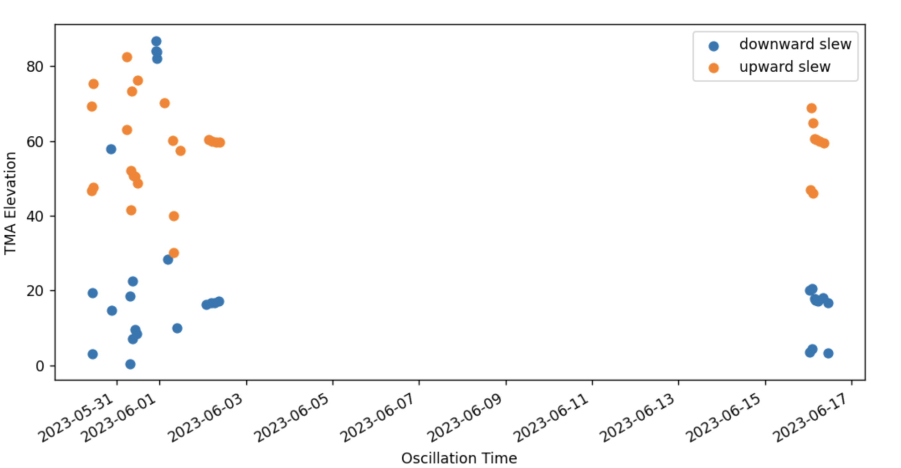
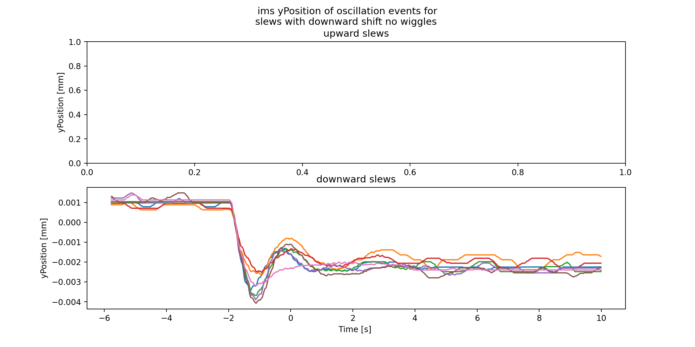
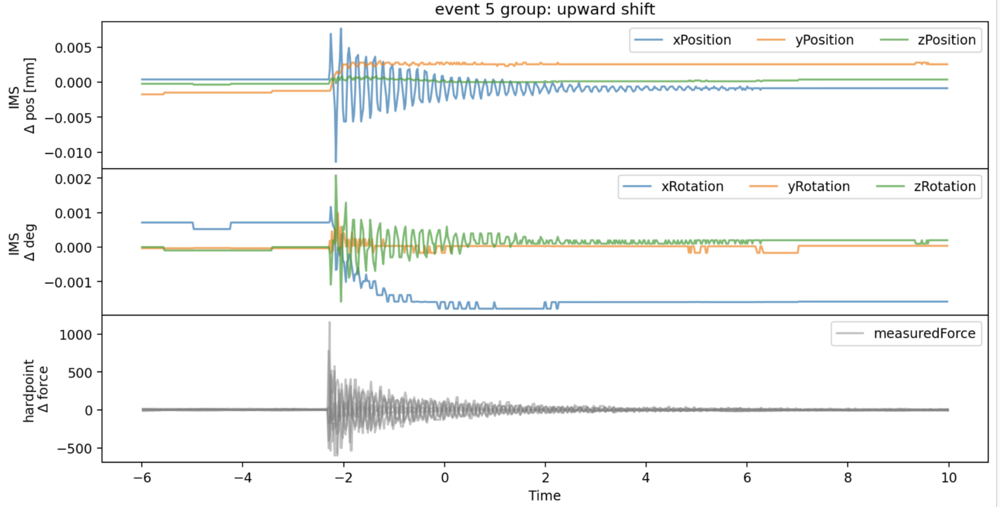
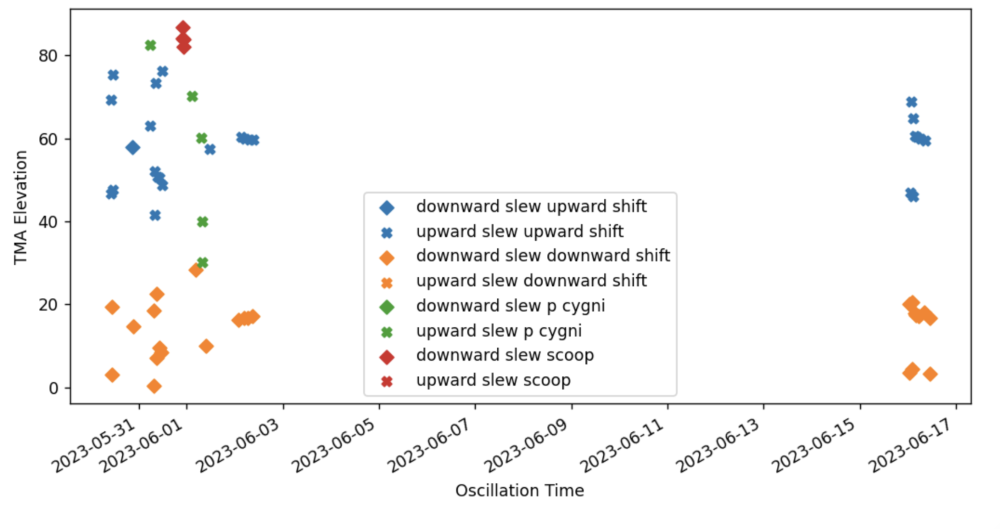
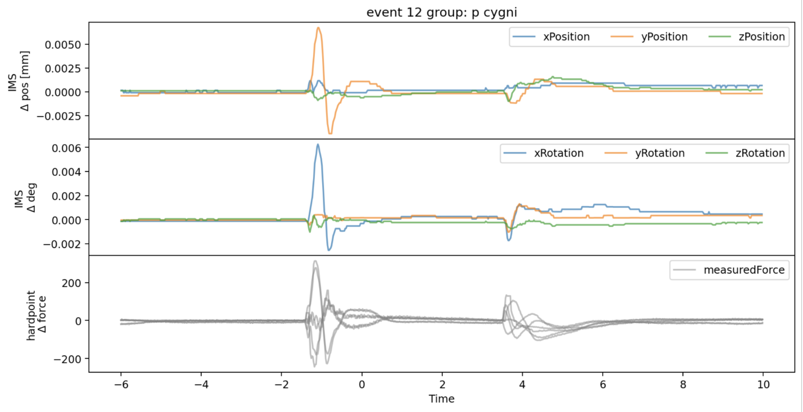

#############################################
Hardpoint oscillations during elevation slews
#############################################

.. abstract::

   This is linked to SITCOM-918

.. Metadata such as the title, authors, and description are set in metadata.yaml

.. TODO: Delete the note below before merging new content to the main branch.

.. note::

   **This technote is a work-in-progress.**

Abstract
========
** still very much in progress**

This note contains the analysis of oscilations seen in the hard point measuredForces during elevation slews.
This is linked to SITCOM-918

Introduction
================

Identification of slews
=======================

<<<<<<< HEAD
.. Make in-text citations with: :cite:`bibkey`.
.. Uncomment to use citations
.. .. rubric:: References
.. 
.. .. bibliography:: local.bib lsstbib/books.bib lsstbib/lsst.bib lsstbib/lsst-dm.bib lsstbib/refs.bib lsstbib/refs_ads.bib
..    :style: lsst_aa
=======
Just to show an example of how I am identifying oscillation events.
In this plot I show the elevation of the TMA as an orange line the points show a rolling standard deviation of the hardpoint measured forces. The red diamonds are identified events. They have a large peak in the rolling standard deviation in at least 4 hardpoints during a slew.

Here is the distribution in elevation vs time of the identified events the color shows the direction of the slew.

IMS yPosition investigation of events
=====================================

I decided to start looking at the IMS data for these slew events. I noticed that there were jumps in the ims ``yPosition``  that corresponded with these events.
The ``yPosition`` jumps seemed to fall into 4 categories that I poorly named:
- upward shift
- downward shift
- p cygni
- scoop

I also noticed that sometimes regular oscillations (wiggles) were superimposed on the ``yPosition``  shifts, and I separated those out
For the following few plots I am showing one of the above groups, the top panel is upward slews, and the bottom panel is downward slews. The x axis is time relative to event, and the y axis is the ims yPosition

Upward shifts
-------------

downward shifts
---------------

p cygni
------------------

scoop
------------------

The p cygni/scoop events seem to be a different type of oscillation, so I will include the rest of their plots at the end.

Measured forces
===============
Next I looked back at the ``lsst.sal.MTM1M3.hardpointActuatorData``  hardpoint ``measuredForces``, again breaking them up by group. Here I show examples of the delta force from the mean before the event (with an offset) as a function of time.

.. image:: ./_static/DeltaForce_upward_shift.png

These two exampes illustrate the behaviour of all of these events (all were visually inpected) where ghe measured force amplitude was always much lower for hardpoints 1 & 4, corresponding to the hardpoints in line with the elevation rotation axis

Full summary plots
==================

Here are some examples of events showing the ims (position/rotation) as a function of time and the harpoiont measured force as a reference. It looks like there may be something interesting in the rotations as well

Elevation of upward/downward shift events
==========================================

inally, here is the elevation vs time plot where I color coded based on event category (shape shows upward/downward slew). This shows some consistent behaviour in the elevation of these oscillation events.

Next Steps
==========
From Petr the next few steps are:

- Get PSD out of oscillation (of measuredForces), find dominant frequency (shall be one, around 7Hz), see that’s good fit for duration of the oscillation, get out initial peak (energy) + dumping, fit it to curve to find “frequency shift”
- Also look at https://ts-xml.lsst.io/sal_interfaces/MTM1M3.html#forceactuatordata - primaryCylinderFollowingError and secondaryCylinderFollowingError
- Chronograf dashboards can be accessed via URL. Providing a HTML page with events, their dates, and links to various Chronograf displays might be interesting as well
- example url: https://summit-lsp.lsst.codes/chronograf/sources/1/dashboards/207?refresh=Paused&tempVa[…]10%3A07%3A57.353Z&zoomedUpper=2023-05-30T10%3A08%3A02.962Z
- https://en.wikipedia.org/wiki/Damping - you need to find phase angle of couple of hundreds oscillators
- And if you can mention the FRACAS - https://jira.lsstcorp.org/browse/FRACAS-158 - on Confluence
- More on force actuators following error. Those are errors in actuator space. Shall be converted to the mirror space. Best I can do would be providing function in ts_cRIOpy which can do that - you feed in force actuators values, out goes 3 * 156 of XYZ forces

Apendix: p cygni/scoop
======================

Measured forces
---------------

Full summary plots
------------------

.. image:: ./_static/summary_scoop.png
>>>>>>> 3323e26 (First update)
